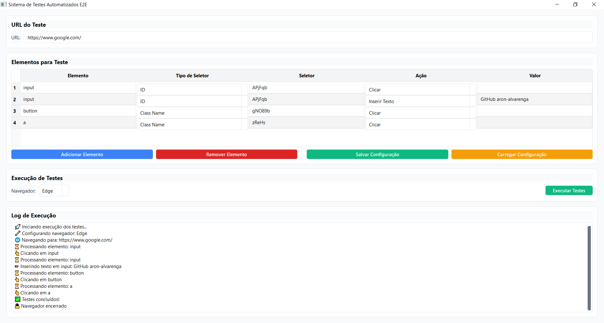

# 🤖 App Teste automatizado E2E

## 📝 Descrição do Projeto

Este é um aplicativo de teste automatizado end-to-end (E2E) desenvolvido em Python, projetado para facilitar testes de interface web de forma simples e flexível. A ferramenta oferece uma interface gráfica intuitiva para configurar e executar testes em diferentes navegadores.

## ✨ Funcionalidades Principais

- Interface gráfica amigável para configuração de testes
- Suporte para múltiplos navegadores (Chrome, Firefox, Edge)
- Mapeamento de elementos web com diferentes tipos de seletores
- Ações configuráveis: inserir texto, clicar, verificar texto
- Geração automática de dados de teste
- Salvamento e carregamento de configurações de teste
- Captura automática de screenshots em caso de erros
- Logging detalhado de execução

## 🛠️ Requisitos do Sistema

- Python 3.8+
- Sistemas Operacionais: Windows, macOS, Linux

## 📦 Dependências

Instale as dependências usando pip:

```bash
pip install PyQt5 selenium webdriver-manager faker
```

## 🚀 Instalação

1. Clone o repositório:

```bash
git clone https://github.com/aron-alvarenga/app-teste-automatizado-e2e.git
cd app-teste-automatizado-e2e
```

2. Instale as dependências:

```bash
pip install -r requirements.txt
```

## 🔧 Como Usar

### Configurando um Teste

1. Abra a aplicação
2. Insira a URL do site para testar
3. Adicione elementos para teste:
   - Clique em "Adicionar Elemento"
   - Selecione o tipo de seletor (ID, XPath, etc.)
   - Escolha a ação (Inserir Texto, Clicar, etc.)
   - Adicione valores de teste

### Salvando Configurações

- Use o botão "Salvar Configuração" para salvar seus testes em um arquivo JSON
- Use "Carregar Configuração" para recuperar testes salvos anteriormente

### Recursos Especiais

#### Geração de Dados Aleatórios

Use o prefixo `random:` seguido do tipo de dado para gerar dados automáticos:

- `random:nome` - Gera um nome aleatório
- `random:email` - Gera um email aleatório
- `random:telefone` - Gera um número de telefone aleatório

#### Captura de Screenshots

- Erros durante os testes automaticamente geram screenshots
- Screenshots são salvas na pasta `error_screenshots`

## 🖥️ Executando o Aplicativo

```bash
python main.py
```

## 🧪 Exemplo de Configuração de Teste

```json
[
  {
    "elemento": "username",
    "tipo_seletor": "ID",
    "seletor": "login-username",
    "acao": "Inserir Texto",
    "valor": "random:nome"
  },
  {
    "elemento": "login-button",
    "tipo_seletor": "XPath",
    "seletor": "//button[@type='submit']",
    "acao": "Clicar",
    "valor": ""
  }
]
```

## ⚠️ Limitações Conhecidas

- Requer instalação prévia dos drivers de navegador
- Performance pode variar dependendo da complexidade do site
- Alguns sites com proteções avançadas podem dificultar a automação

## 🐛 Solução de Problemas

- Verifique se todos os drivers de navegador estão atualizados
- Consulte o arquivo `e2e_tester.log` para detalhes de erros
- Screenshots de erros estão disponíveis na pasta `error_screenshots`

## 🤝 Contribuições

Contribuições são bem-vindas! Por favor, abra uma issue ou envie um pull request.

## 📞 Contato

- https://www.linkedin.com/in/aron-alvarenga

## 🖼️ Imagem da aplicação

<div align="center">
  
</div>
